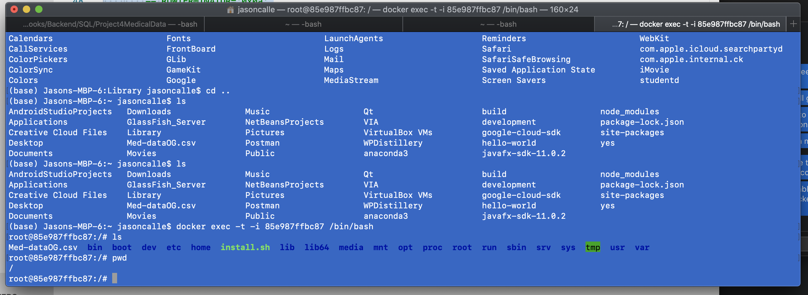
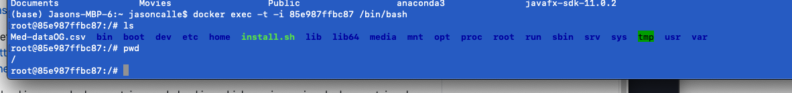

# MedicalDataSQL
Normalized data from an input file that had information about a customers health data resulting in three different tables with relations.  

Tables: 
 
1. Customer_Info (PK:Customer_Id) + customer_info + employment + education + 16 columns of different health constraints
 
2. Customer_address (PK: Customer_id+ZipCode) Columns: state, city, county, population, area
 
3. cardiac patients (PK: Columns identity)+ customer_id+ highblood, overwieght, hyperlipidemia, stroke
 

1. Identified all patients with High Blood pressure or Hyperlipidemia in the Cardiac Patients table 
 

2. Generated a list of patients who were found have the most common disease among senior citizens by
 using <b>dynamic queries</b> and <b>stored procedures</b> <b>Folder 9</b> 
 
 
3. Process was done similarly for female patients for the least common disease <b>Folder 10</b>
 

4. Most common disease was found among all patients through similar procedures <b>Folder 11</b>
 
5. Generated a list of patients who have anxiety, and are overweight and have Reflux_esophagitis 
and/or Allergic_rhinitis and/or Asthma. <b>Folder 12</b>
 

#Stored Procedures  

  @Disease referes to the column name - Input Variable  
  @DiseaseCount - Output variables  

  1. countFunction2 @DiseaseInput @DiseaseCount  

  Takes the name of the disease as an Input
  and then outputs the count of customers with that disease  

  2. returnCustomer @Disease  

  Executes a list of customers with a certain disease  

  3. MostCommonDisease  

  a. uses CountFunction2 to iterate through the columns keeping 
  track of the highestCount  

  b.  returning the list of customers
   with the returnCustomer procedure.  

  c. Also prints out the disease with its count.  

Project Date (Started):November 27, 2020 
 

Since im working on MAC I had to use docker  
- I had to move the input files to docker's container to be able to load them in the container  

Sucessfully loaded 10,000 rows of data.  

Refernce for Formatting 
https://docs.microsoft.com/en-us/sql/t-sql/statements/bulk-insert-transact-sql?view=sql-server-ver15#interoperability

Reference for copying the excel file to docker's container
https://dba.stackexchange.com/questions/241082/macos-docker-cannot-bulk-load-the-file-path-does-not-exist-or-you-dont-have

<b>Commands: </b> Checking your docker container and check which one is running  
1. docker container ls  
- my docker container was: 85e987ffbc87  
  

2. Checking your docker containers file  
    docker exec -t -i mycontainer /bin/bash  

